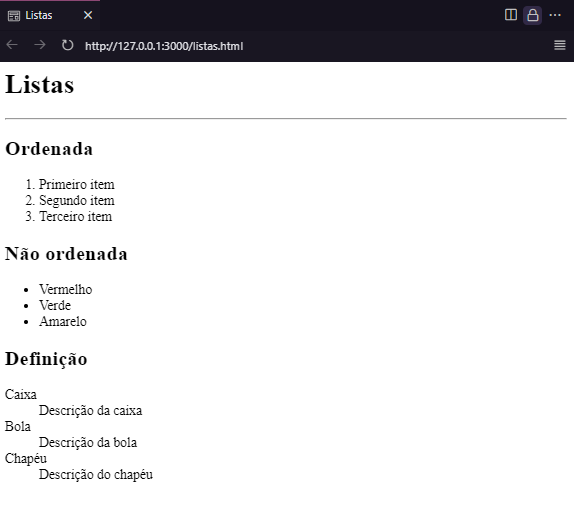

# Listas, tabelas e mídia

Adicionando alguns projetos e aprendizagens que estou desenvolvendo na faculdade de Análise e Desenvolvimento de Sistemas da Estácio. Aqui mostro um pouco sobre Listas, tabelas e mídias! 

 ## [Listas](#listas)

- [Ordenadas](#ordenadas)
- [Não ordenadas](#não-ordenadas)
- [Definição](#definição)

## [Tabelas](#tabelas)

- [Estrutura das tabelas](#estrutura-das-tabelas)

## [Midias](#mídia)

- [Vídeo e áudio](#vídeo-e-áudio)

## Listas
### Ordenadas
#### ```<ol>```
> Tag container. Usada para representar dados com ordenação numérica;

#### ```<li>```
> Tag de item.
---
### Não ordenadas
#### ```<ul>```
> Tag container. Usada quando não há ordenação nos dados;

#### ```<li>```
> Tag de item.

### Definição
#### ```<dl>```
> Tag container. Usada quando precisamos listar itens e atribuir descrição.

#### ```<dt>```
> Tag de item.

#### ```<dd>```
> Tag de descrição.
---
<p align="center"></p>

## Tabelas
### Estrutura das tabelas
#### ```<table>```
> Container principal da tabela;

#### ```<tr>```
> Representa a linha, sendo composta por tag de coluna;

#### ```<td>```
> Representa a coluna, inserida dentro da tag de linha;

#### ```<th>```
> Representa a coluna, usada para exibir o titulo da coluna, assim com a tag [&lt;tr&gt;](#tr) é usada dentro da tag de linha, possuindo estilo próprio e função semântica;

#### ```<thead>```
> Armazena o cabeçalho da tabela, sendo composta por linhas e colunas. Possuindo semântica em termo de estruturação de conteúdo;

#### ```<tfood>```
> Rodapé da tabela, possuindo também função semântica em termo de estruturação.

<p align="center"></p>

## Mídias
### Vídeo e Áudio
#### ```<video>```
> Usada para apresentar um vídeo;

#### ```<audio>```
> Usada para apresentar um áudio.

Assim como na tag de imagem, os atributos nestas tags são de suma importância, são eles:
Parâmetro | Descrição
--- | ---
src | Usado para adicionar o caminho/link do arquivo (audio, video ou imagem);
alt | Usado para caso a midia não seja carregada no navegador caso o mesmo não possua suporte para tal midia;
controls | Controle de ações de midia (audio e video);
autoplay | Autoexplicativo. Mais usado em audios;
loop | Também autoexplicativo. Mais usado em audios.
---
<p align="center"></p>

***OBS: Estou explicando cada funcionalidade das tags que estou utilizando com a descrição sobre como foi usado neste repositório, para mais detalhes sobre estas tags veja o site [mdn web doc](https://developer.mozilla.org/pt-BR/docs/Web/HTML).***